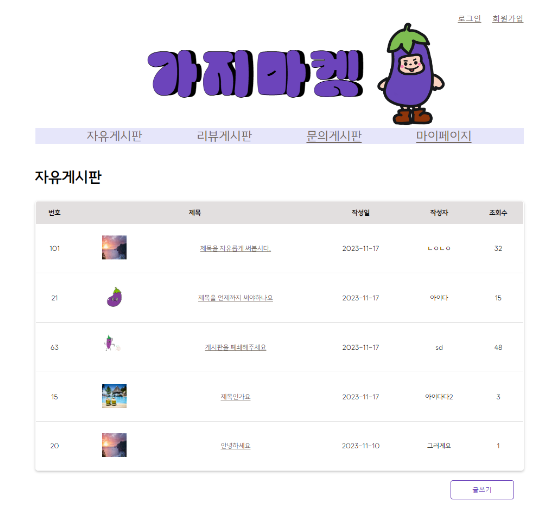
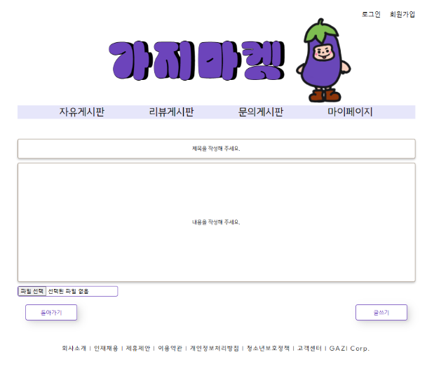
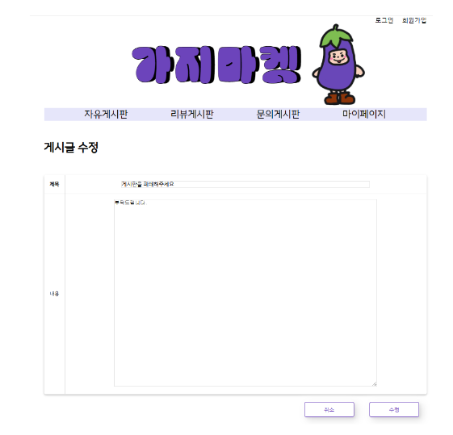
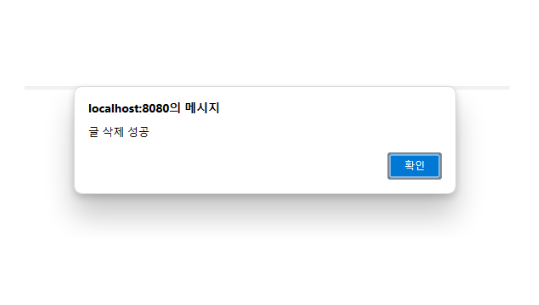
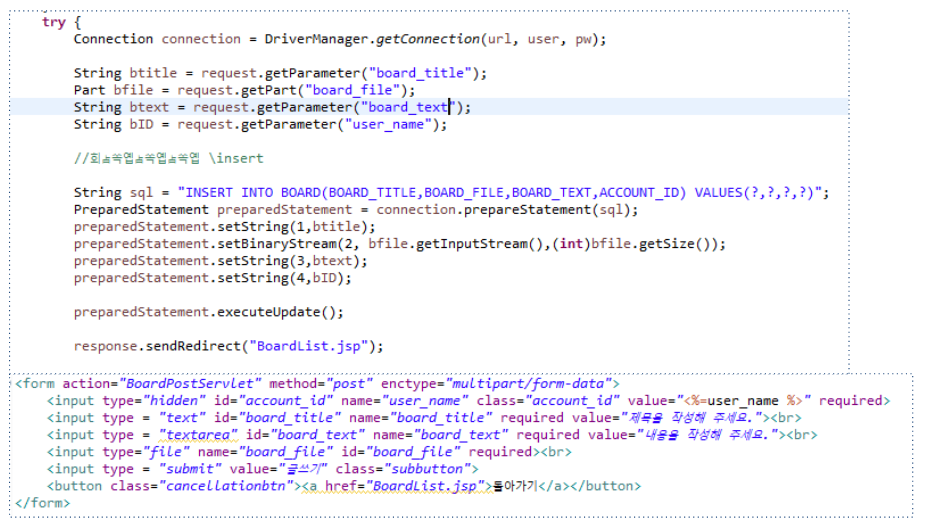
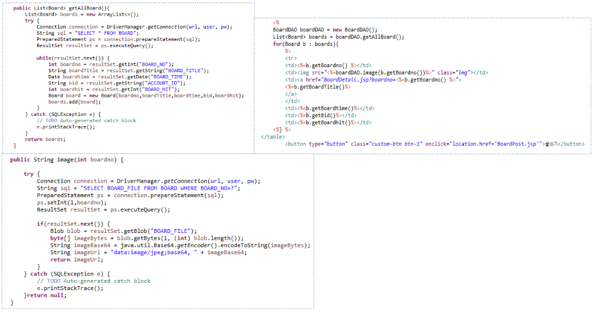
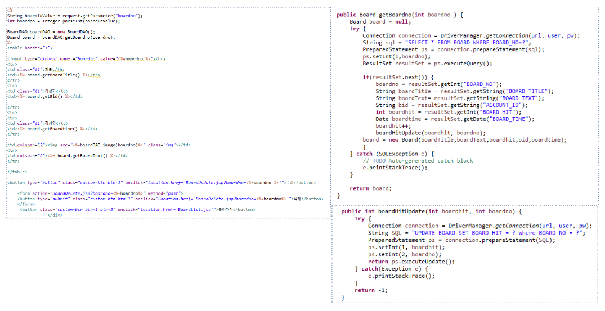
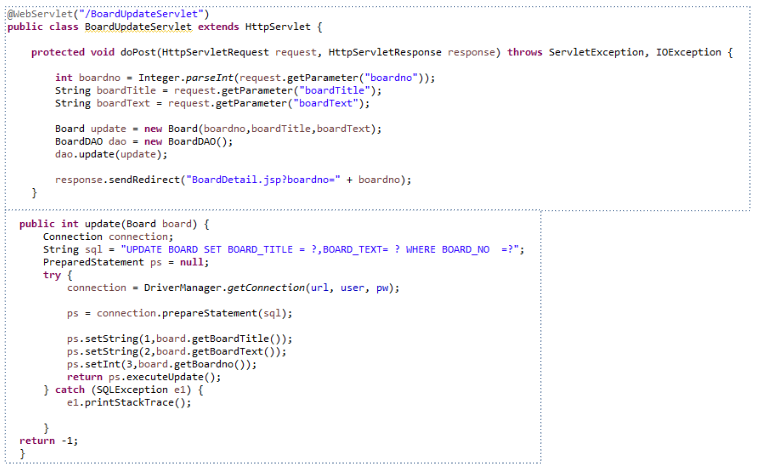
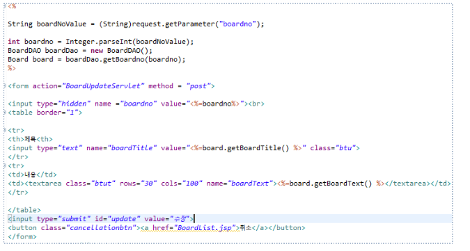
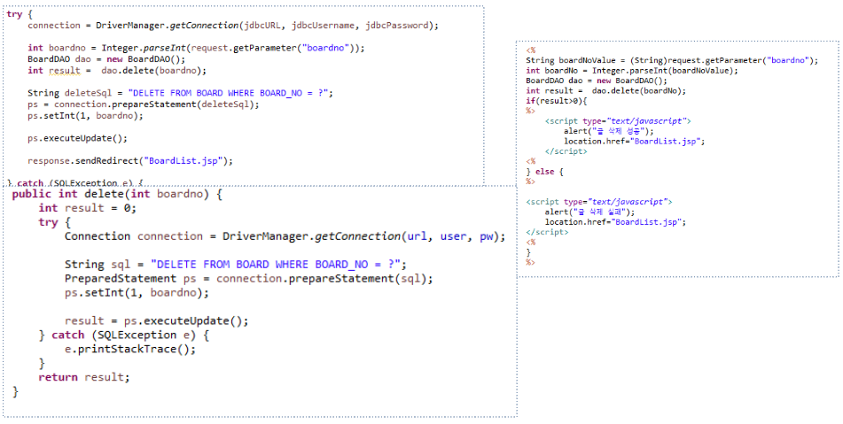

### README

# 가지마켓

   
  
   

## 프로젝트 소개

가지마켓 프로젝트의 개발 목표는 사용자들 간의 쉽고 빠른 중고거래를 제공하는 것입니다. 이를 위해 사용자들이 게시글을 쉽게 작성하고 확인할 수 있도록 기능을 구현하는 것이 목표였습니다. 또한, 사용자들의 편의를 위해 게시글 업데이트 및 삭제, 조회수 기능도 구현하였습니다.

<strong>
<strong>
<strong>
<strong>
<strong>

 

## 기술 스택

| JavaScript |  Java   |
| :--------: | :-----: |
|   ![js]    | ![java] |

 

## 구현 기능

### 자유게시판 글작성

 

### 자유게시판 리스트

 

### 자유게시판 상세페이지

 

### 자유게시판 수정

 
 

### 자유게시판 삭제

 

## 참여소감

웹 화면을 구축하고 싶을때 서블릿과 jdbc,jsp가 각각 어떻게 사용되어 db와 서버와 클라이언트간의 정보들이 전달되는지 가볍게 맛 볼 수 있는 시간이었다.   

 

<!-- Stack Icon Refernces -->

[js]: ./readme-static/img/javascript.svg
[java]: ./readme-static/img/java.svg
